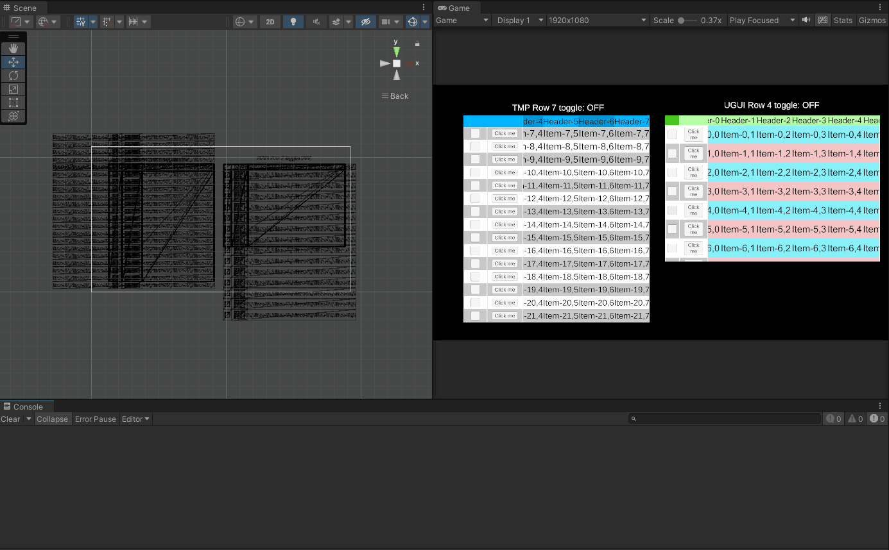

# Unity3D Easy Table UGUI / TMP

一种复合表格插件，提供 UGUI 与 TMP 双版本，行渲染采用快照式虚拟化，大数据量下仅实例化视口内的行，滚动零卡顿。

## 特性

- **双版本共存**：`UGUI` 版（UnityEngine.UI.Text）与 `TMP` 版（TextMeshProUGUI）互不影响，任选使用
- **行虚拟化**：仅实例化"视口高度 + 缓冲（默认 6 行）"数量的行，滚动时快照重排（位置+数据整体重绑定），替代传统全量实例化
- **content 高度自适应**：随数据行数自动撑开（布局系统驱动），滚动范围精确
- **三区域联动**：Toggle 列 / Button 列 / 内容区滚动同步，Header 横滚联动
- **Toggle 状态保持**：勾选状态按数据行号存储，滚动往返不丢失
- **运行时参数生效**：Inspector 调整行高、行/列颜色实时生效（编辑模式预览示例行，运行模式按数据驱动）
- **零 prefab 依赖**：行、单元格由代码实例化，用户无需手动搭建

## 效果演示

## 核心 API（TableController / TMP_TableController）

| 成员 | 说明 |
|---|---|
| `UpdateTableRawData(string json)` | 加载数据（空字符串时生成随机演示数据；后续可扩展 JSON 解析） |
| `CleanTable()` | 清空表格 |
| `RowCount` / `ColumnCount` | 当前数据行数 / 列数（只读） |
| `ToggleChanged` | 事件：`Action<int rowIndex, bool value>`，Toggle 勾选变化 |
| `ButtonClicked` | 事件：`Action<int rowIndex>`，Button 点击 |
